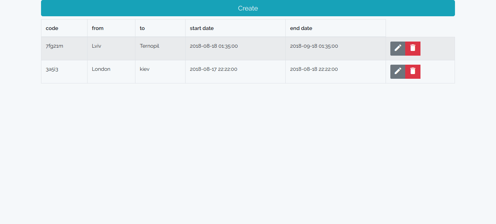
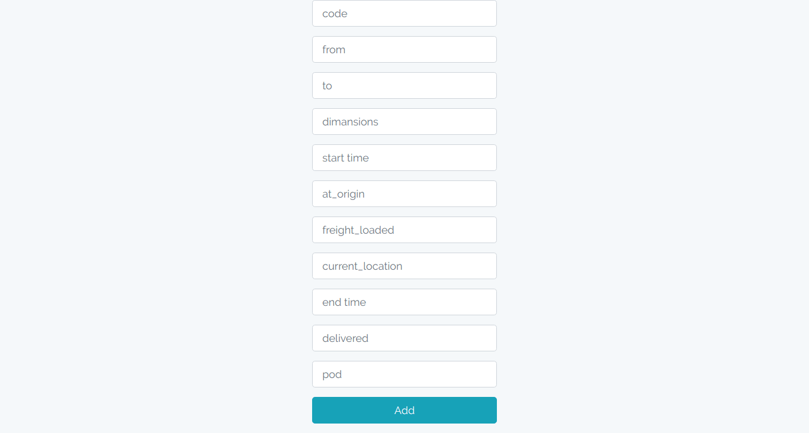

<p align="left"></p>

# Tracking laravel

It use google maps api, to get distance and time for some track.

## What a this? (screenshots, demo)
http://track.ostap34.pp.ua
http://track.ostap34.pp.ua/login (user - admin@noreply.com, password - 12345678)






# Installation

Clone the repository-
```
git clone https://github.com/Ostap34JS/laravel-tracking.git
```

Then cd into the folder with this command-
```
cd laravel-tracking
```

Then do a composer install
```
composer install
```

Then create a environment file using this command-
```
cp .env.example .env
```

Then edit `.env` file with appropriate credential for your database server. Just edit these two parameter(`DB_USERNAME`, `DB_PASSWORD`), and [desirable] add `GOOGLE_MAPS_API_KEY`.

Then create a database named `tracking` and then do a database migration using this command-
```
php artisan migrate
```

Then change permission of storage folder using thins command-
```
(sudo) chmod 777 -R storage
```

At last generate application key, which will be used for password hashing, session and cookie encryption etc.
```
php artisan key:generate
```

## Run server

Run server using this command-
```
php artisan serve
```

Then go to `http://localhost:8000` from your browser and see the app.

# Todo 
- Refactor some parts (remove logic from controllers, etc)
- Update deps
- Update screenshots
